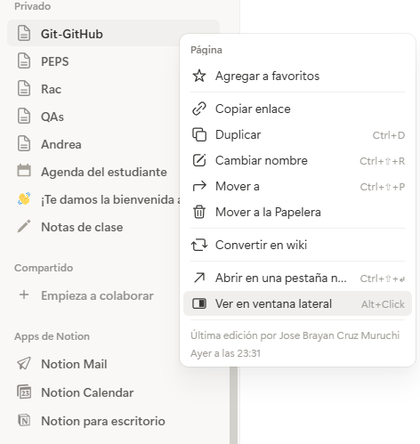

# Trabajo Individual - Curso GIT SCESI 2026

## Jose Brayan Cruz Muruchi

---

# Primera clase
## Clase 1 - Introducción a GIT

### ¿Qué es GIT?

GIT es un Sistema de Control de Versiones Distribuido (VCS). Básicamente 
nos permite guardar archivos y el historial de cambios de estos a lo largo del tiempo. Una buena manera de entenderlo es como los checkpoints de un  videojuego: si algo sale mal, puedes volver a un punto anterior sin perder todo tu progreso. Además, no es solo una herramienta individual, sino que puede usarla todo un equipo de trabajo al mismo tiempo.

### ¿Cómo nació GIT?

Linus Torvalds, el creador de Linux, recibía contribuciones al kernel de 
Linux por email y las revisaba manualmente una por una. Para organizarse 
mejor, él y su comunidad empezaron a usar BitKeeper, una herramienta de 
control de versiones que tenía una condición: no podías usar ninguna otra 
herramienta similar. En algún momento alguien rompió ese acuerdo y BitKeeper les quitó el acceso. Linus, en lugar de volver al método del email, decidió crear su propia herramienta. En aproximadamente 2 a 3 semanas de puro código y determinación, creó GIT. Así de simple (y dramático) fue su origen.

### ¿Cómo instalar GIT?

1. Ir a https://git-scm.com/install/
2. Descargar el instalador según tu sistema operativo (Windows, macOS o Linux)
3. Seguir los pasos de instalación recomendados
4. Verificar que quedó bien instalado con:

```bash
git --version
```


**Nota para Linux (Ubuntu/Debian):**
```bash
sudo apt-get install git
```

### Configuración inicial

Después de instalar, hay que decirle a GIT quién eres. Esto es importante 
porque cada cambio que hagas va a quedar registrado con tu nombre y correo.

```bash
git config --global user.name "Tu Nombre"
git config --global user.email "tu@correo.com"
git config --global core.autocrlf true
```

Para verificar que quedó guardado:
```bash
git config --global --list
```

### Archivos esenciales en todo repositorio

Todo repositorio debería tener al menos estos dos archivos:

- **README.md** → Es la carta de presentación del proyecto. Explica qué 
  hace, cómo usarlo, quién lo hizo, etc. Se escribe en formato Markdown.
- **.gitignore** → Le dice a GIT qué archivos debe ignorar (credenciales, 
  archivos temporales, etc.). Se verá más en detalle en clases futuras.

### Primeros pasos con GIT (adelanto de la clase)

Para inicializar un repositorio GIT en una carpeta:
```bash
git init
```

Para ver el estado de los archivos:
```bash
git status
```

Para agregar un archivo al seguimiento:
```bash
git add README.md
```

Para guardar los cambios (hacer un commit):
```bash
git commit -m "mi primer commit"
```

Para ver el historial de commits:
```bash
git log
```

### Formato básico de Markdown para el README

```markdown
# Título principal
## Subtítulo
### Sub-subtítulo

Párrafo normal así nomás.

# Bloque de código
código aquí
# fin bloque
```

# Clase 2 - States y Commits

### Los 3 estados de GIT

GIT maneja cada archivo en tres estados distintos:

**1. Directorio de Trabajo (Modificado)**
Es tu carpeta local donde escribes tu código. GIT observa 
lo que haces y cataloga los archivos en dos tipos:
- **Untracked**: archivo nuevo que GIT nunca ha visto antes
- **Modified**: archivo que GIT ya tenía guardado y que fue 
  modificado, eliminado o renombrado

Cualquier archivo que NO esté en el `.gitignore` pasa 
automáticamente a uno de estos estados.

**2. Stage Area (Preparado)**
Es el área de espera. Aquí le dices a GIT exactamente qué 
archivos quieres incluir en el próximo punto de guardado.

**3. Repositorio Local (Confirmado)**
Es el historial. Tus cambios ya tienen un ID (hash) y son 
parte permanente de la historia del proyecto.

Una buena manera de visualizarlo: el Directorio de Trabajo 
es el supermercado, el Stage Area es el carrito de compras 
y el Repositorio Local es la caja registradora donde se 
confirma todo.

---

### Comandos del Directorio de Trabajo

Ver el estado de todos los archivos:
```bash
git status
```

Descartar cambios de un archivo (cuidado: borra físicamente 
lo escrito):
```bash
git restore <archivo>
```

Para ignorar archivos sensibles (credenciales, variables de 
entorno, etc.), se agrega su nombre al `.gitignore`:

.env
*.pyc
carpeta/

---

### Comandos del Stage Area

Agregar un archivo específico:
```bash
git add <archivo>
```

Agregar todos los archivos modificados:
```bash
git add .
```

Sacar un archivo del stage (vuelve a Modified sin perder 
el contenido):
```bash
git restore --staged <archivo>
```

---

### Repositorio Local - Commits

Crear un punto de guardado con todos los archivos en stage:
```bash
git commit -m "mensaje descriptivo"
```

Ver el historial de commits:
```bash
git log
git log --oneline
```

Deshacer el último commit (los archivos vuelven a stage):
```bash
git reset --soft HEAD~1
```

Modificar el mensaje del último commit:
```bash
git commit --amend
```

---

### Buenas Prácticas para Commits

**1. Commits atómicos**: cada commit debe representar un 
único cambio lógico y pequeño. Si hiciste dos cosas, 
haz dos commits separados.

**2. Verbos imperativos**: Add, Change, Fix, Remove, etc.

**3. Sin punto final ni puntos suspensivos** en el mensaje.

**4. Máximo 50 caracteres** en el título del commit.

**5. Usa prefijos** para hacer los commits más descriptivos:

| Prefijo | Cuándo usarlo |
|---------|--------------|
| `feat` | Nueva característica |
| `fix` | Corrección de bug |
| `docs` | Cambios en documentación (README) |
| `style` | Cambios de formato |
| `refactor` | Refactorización de código |
| `perf` | Mejoras de rendimiento |
| `build` | Cambios en el sistema de build |
| `ci` | Integración continua |
| `test` | Tests |

Ejemplos:
```bash
git commit -m "feat: Add sum function in script.js"
git commit -m "docs: Add fruit list to README"
git commit -m "fix: Fix login validation bug"
```

**6. Cuerpo del commit** cuando necesitas más contexto:
```bash
git commit
# Primera línea: título (máx 50 caracteres)
# Segunda línea en adelante: descripción detallada
```

> Nota: Los commits deben escribirse en inglés.

## Clase 3 - GitHub y SSH

### ¿Qué es GitHub?

GitHub es una plataforma en la nube y red social para 
desarrolladores que permite alojar, gestionar y colaborar 
en proyectos de software usando Git. Es importante no 
confundirlos: Git es el sistema que crea los puntos de 
guardado de manera local, mientras que GitHub es el 
servidor donde esos puntos se almacenan y comparten con 
el mundo. GitHub usa Git, pero no son lo mismo.

---

### SSH vs HTTPS

Para conectarse a GitHub existen dos métodos:

**HTTPS**: cada vez que quieras subir cambios te va a pedir 
usuario y contraseña, y en muchos casos ni siquiera te 
deja hacerlo. Es molesto e ineficiente.

**SSH**: configuras una llave en tu PC que GitHub reconoce 
automáticamente, sin pedirte credenciales cada vez.

> Por lo tanto, siempre usa SSH.

---

### Configuración de SSH

En tu terminal (Linux) o Git Bash (Windows) ejecuta:

```bash
# 1. Generar la llave SSH
ssh-keygen -t ed25519 -C "tu-correo@email.com"

# 2. Ver el contenido de tu llave pública
cat ~/.ssh/id_ed25519.pub
```

Luego copias ese contenido y vas a GitHub:
`Perfil → Settings → SSH and GPG Keys → New SSH Key`

Pegas tu llave, le pones un nombre para identificar tu PC 
y click en "Add SSH Key".

Para verificar que funcionó:
```bash
ssh -T git@github.com
# Debe aparecer: "Hi <tu-usuario>! You've successfully authenticated"
```

---

### Crear un repositorio en GitHub

1. Ir a tu apartado de repositorios en GitHub y click en 
   "New"
2. Poner el nombre del repositorio y una descripción 
   opcional
3. Elegir visibilidad: Public (cualquiera lo ve) o 
   Private (solo tú y quien invites)
4. Click en "Create Repository"

> Nota: no uses tu correo institucional para crear la 
> cuenta, porque al terminar la carrera pierdes acceso y 
> con ello todos tus proyectos.

---

### Conectar tu repositorio local con GitHub

Una vez creado el repositorio en GitHub, desde tu terminal:

```bash
# Conectar el repo local al remoto
git remote add origin git@github.com:TuUser/TuRepo.git

# Renombrar la rama principal a main (si aún dice master)
git branch -M main

# Subir todo al repositorio remoto por primera vez
git push -u origin main
```

`origin` es simplemente el apodo que Git le da por defecto 
a la URL de tu repositorio remoto.

> Requisito: ya debes tener `git init` hecho y al menos 
> un commit antes de hacer esto.

---

### Clonar un repositorio

Para descargar un repositorio en otra computadora o en 
una nueva carpeta:

```bash
git clone "git@github.com:TuUser/TuRepo.git"
```

Si por accidente lo clonaste con HTTPS, puedes cambiar 
el puntero con:
```bash
git remote set-url origin "git@github.com:TuUser/TuRepo.git"
```

Para ver a qué repositorio remoto está conectado tu repo:
```bash
git remote -v
```

---

### Subir y bajar cambios

Subir tus commits a GitHub:
```bash
git push origin <rama>
```

Traer los cambios del repositorio remoto a tu máquina:
```bash
git pull origin <rama>
```

---

### Extra: Perfil de GitHub como portafolio

Si creas un repositorio con exactamente el mismo nombre 
que tu usuario de GitHub, ese README aparece en tu perfil 
público. Es una forma sencilla de tener un mini portafolio 
visible para cualquier persona o empresa que visite tu 
cuenta.

## Evidencia - Notion



## Clase 4 - Git Remote, SSH Múltiple y Git Checkout

### Git Remote

`git remote` es el comando que gestiona las conexiones con
repositorios remotos. Le dice a Git a qué dirección debe
enviar o traer información. Funciona como un arquero
apuntando a un objetivo, donde la URL es el objetivo y
el apodo (alias) es una forma corta de llamar a esa URL.

Comandos principales:

```bash
# Ver las URLs a las que apunta tu repositorio
git remote -v

# Cambiar o actualizar la URL del repositorio remoto
git remote set-url origin "git@github.com:TuUser/TuRepo.git"
```

Cuando hacemos `git push origin main`, "origin" es el
apodo que reemplaza a la URL completa del repositorio.
`set-url` no solo sirve para cambiar de HTTPS a SSH,
también sirve para apuntar a un repositorio completamente
distinto.

---

### SSH con Múltiples Cuentas de GitHub

Cuando tienes más de una cuenta de GitHub (por ejemplo,
una personal y una de trabajo), cada cuenta necesita su
propia llave SSH. Es como tener puertas con cerrojos
distintos, cada una con su propia llave.

**Pasos para configurar múltiples llaves SSH:**

```bash
# 1. Generar una llave nueva con un nombre distinto
#    El flag -f indica dónde y con qué nombre guardarla
ssh-keygen -t ed25519 -C "tu-correo@email.com" -f ~/.ssh/id_auxi

# 2. Ver las llaves generadas
ls -a ~/.ssh/
```

Luego copias la llave pública y la agregas a tu cuenta
de GitHub en Settings → SSH and GPG Keys.

**Crear el archivo config** (solo necesario cuando tienes
más de una cuenta):

```bash
touch ~/.ssh/config
```

Dentro del archivo `config` pones algo así:
Cuenta principal
Host github.com
HostName github.com
User git
IdentityFile ~/.ssh/id_ed25519
Cuenta secundaria
Host github-auxi
HostName github.com
User git
IdentityFile ~/.ssh/id_auxi
El `Host` es el alias de la conexión. El `HostName` es
el servidor real (siempre github.com). El `IdentityFile`
es la ruta a la llave que debe usar.

Para probar la conexión de la cuenta secundaria:
```bash
ssh -T git@github-auxi
```

Al clonar con la cuenta secundaria, usas el alias en lugar
de github.com:
```bash
git clone git@github-auxi:TuUser/TuRepo.git
```

---

### Configuraciones Globales vs Locales

Las configuraciones tienen una jerarquía: local > global.
La configuración local de un repositorio siempre gana
sobre la global.

```bash
# Configuración global (aplica a todos los repos)
git config --global user.name "Tu Nombre"
git config --global user.email "tu@correo.com"

# Configuración local (solo aplica al repo actual)
git config user.name "Otro Nombre"
git config user.email "otro@correo.com"

# Ver todas las configuraciones activas
git config --global --list
```

Esto es importante cuando trabajas con cuentas distintas,
porque si no cambias la configuración local tus commits
van a aparecer con el usuario equivocado.

---

### Git Checkout

`git checkout` permite desplazarse hacia commits anteriores
para ver cómo estaba el código en ese momento. Es como
viajar al pasado como espectador.

```bash
# Ver el historial resumido de commits
git log --oneline

# Ir a un commit pasado (usar los primeros 7 caracteres del hash)
git checkout abc1234

# Volver a la rama principal
git checkout main
```

Cuando estás en un commit pasado, te encuentras en un
estado llamado **detached HEAD**, lo que significa que no
estás en ninguna rama, estás parado en un punto de
guardado específico.

Para qué sirve el checkout:
- Ver cómo estaba el código antes de un cambio
- Recuperar archivos que fueron borrados
- Explorar el historial de un proyecto

> Importante: no puedes hacer checkout si tienes cambios
> sin commitear. Git te va a pedir que primero guardes o
> descartes tus cambios.

> Recomendación: úsalo solo para observar el pasado,
> no para trabajar desde ahí. Si necesitas algo de un
> commit pasado, tómalo y vuelve a tu rama principal
> para trabajar.

Si por alguna razón hiciste cambios en detached HEAD y
los quieres conservar, puedes crear una rama desde ahí:

```bash
git checkout -b nombre-rama-experimental
```

# 📚 Clase 5: Ramas y Gitflow Básico

## 🌿 ¿Qué son las ramas?

Las ramas (branches) en Git son una herramienta fundamental que permite trabajar con diferentes versiones del código de forma paralela.

Una rama es básicamente una **bifurcación del estado del proyecto**, lo que significa que puedes crear una copia del código actual y trabajar sobre ella sin afectar la rama principal.

### 📌 ¿Para qué sirven?

* Evitar romper el código principal
* Trabajar en nuevas funcionalidades
* Facilitar el trabajo en equipo
* Probar cambios sin riesgo

---

## ⚙️ Comandos básicos de ramas

### 🔹 Listar ramas

```bash
git branch
```

Muestra todas las ramas disponibles y en cuál estás actualmente.

---

### 🔹 Crear una rama

```bash
git branch <nombre-rama>
```

Crea una nueva rama basada en la rama actual.

---

### 🔹 Eliminar una rama

```bash
git branch -D <nombre-rama>
```

Elimina una rama.

---

## 🔄 Navegar entre ramas

### 🔹 Cambiar de rama

```bash
git checkout <rama>
```

Permite moverse entre ramas.

⚠️ Importante:
No debes tener cambios sin guardar (modified, staged o untracked).

---

### 🔹 Crear y cambiar a una rama

```bash
git checkout -b <rama>
```

Crea una nueva rama y automáticamente te mueve a ella.

---

## 🔁 Git Checkout vs Git Switch

### 🔹 git checkout

* Es un comando multipropósito
* Sirve para:

  * Cambiar ramas
  * Volver a commits antiguos
  * Restaurar archivos
* Puede causar errores como *detached HEAD*

---

### 🔹 git switch

* Es un comando más moderno (desde Git 2.23)
* Solo sirve para manejar ramas
* Es más seguro y fácil de usar

### 📌 Ejemplos:

```bash
git switch <rama>
git switch -c <rama>
```

---

## 🧠 Concepto clave: HEAD

HEAD es el puntero que indica en qué rama estás trabajando actualmente.

Ejemplo:

* Si estás en `main`, HEAD apunta a `main`
* Si cambias de rama, HEAD cambia automáticamente

---

## ⚠️ Importante al cambiar de rama

Si tienes cambios sin guardar, Git puede impedir que cambies de rama.

Esto ocurre porque podrías perder cambios.

👉 Soluciones:

* Hacer commit
* Usar `git stash` (se verá más adelante)

---

## 🚀 ¿Qué es Gitflow?

Gitflow es un **flujo de trabajo** que define reglas para usar ramas de forma organizada.

Permite:

* Mantener orden en el proyecto
* Facilitar el trabajo en equipo
* Entender fácilmente el estado del código

---

## 🌳 Estructura de Gitflow

### 🔹 main

* Contiene el código en producción
* Es la versión estable

---

### 🔹 develop

* Rama de desarrollo principal
* Aquí se integran las nuevas funcionalidades

---

### 🔹 Ramas de apoyo

Son ramas temporales para tareas específicas:

---

## 🧩 Tipos de ramas en Gitflow

### 🔹 feature/*

* Se crean desde `develop`
* Se usan para nuevas funcionalidades
* Se fusionan nuevamente en `develop`

Ejemplos:

```bash
feature/login
feature/register-user
feature/search-bar
```

---

### 🔹 release/*

* Se crean desde `develop`
* Se usan para preparar una versión
* Incluyen pruebas (QA)

Ejemplos:

```bash
release/v1.0.0
release/v2.0.0-beta
```

---

### 🔹 hotfix/*

* Se crean desde `main`
* Se usan para corregir errores en producción

Ejemplos:

```bash
hotfix/login-error
hotfix/security-patch
hotfix/api-timeout
```

---

## 📊 Resumen de ramas

| Rama      | Nace de | Muere en       | Propósito                      |
| --------- | ------- | -------------- | ------------------------------ |
| main      | —       | —              | Código en producción           |
| develop   | main    | —              | Desarrollo principal           |
| feature/* | develop | develop        | Nuevas funcionalidades         |
| release/* | develop | main y develop | Preparar versiones             |
| hotfix/*  | main    | main y develop | Corrección de errores urgentes |

---

## 🧠 Idea clave de las ramas

Las ramas permiten trabajar como si hicieras copias del proyecto:

Antes (sin Git):

* Copiar carpetas manualmente
* Riesgo de desorden

Ahora (con Git):

* Creas ramas
* Trabajas sin afectar el código principal
* Puedes eliminar cambios fácilmente

---

## 🤝 Trabajo en equipo con ramas

Cada persona puede trabajar en su propia rama:

* Juan → feature/login
* Ana → feature/register

Luego:

* Se combinan (merge)
* Se evita conflictos y desorden

---

## ✅ Conclusión

Las ramas son esenciales en Git porque:

* Permiten trabajar de forma paralela
* Evitan errores en producción
* Facilitan el trabajo en equipo
* Organizan el desarrollo del proyecto

Y con Gitflow:


# 📚 Clase 6: Merge y Trabajo con Repositorios Remotos

## 🔀 ¿Qué es git merge?

El comando `git merge` significa **fusión**.

Permite unir dos ramas en una sola, combinando sus cambios para que ambas compartan los mismos commits.

👉 En otras palabras:
Sirve para integrar el trabajo de una rama dentro de otra.

---

## ⚙️ Uso de git merge

```bash
git merge <rama>
```

Fusiona la rama indicada con la rama actual.

---

## 🧠 Flag importante: --no-ff

```bash
git merge --no-ff <rama>
```

### 📌 ¿Qué hace?

* Evita el **fast forward**
* Obliga a crear un commit de merge
* Mantiene el historial de ramas visible

👉 Esto es importante porque:

* No se pierde la estructura del trabajo
* Puedes ver claramente cuándo se hizo una fusión

---

## 🔍 ¿Qué es git fetch?

`git fetch` permite verificar si hay cambios en el repositorio remoto.

### 📌 Características:

* Trae información de cambios
* **No modifica tu código local**
* Solo actualiza referencias

👉 Es como decir:
“Revisa si hay cambios, pero no los descargues todavía”

---

## ⬇️ ¿Qué es git pull?

`git pull` descarga los cambios del repositorio remoto y los aplica en tu rama actual.

```bash
git pull origin <rama>
```

### 📌 Características:

* Trae cambios del remoto
* Los fusiona automáticamente
* Es equivalente a:

  * `git fetch` + `git merge`

---

## ⬆️ ¿Qué es git push?

`git push` envía tus cambios al repositorio remoto.

```bash
git push origin <rama>
```

### 📌 Características:

* Sube commits al repositorio
* Actualiza la rama remota

---

## ⚠️ Primer push de una rama

Si es la primera vez que subes una rama:

```bash
git push -u origin <rama>
```

### 📌 ¿Por qué usar -u?

* Vincula la rama local con la remota
* Evita tener que escribir `origin <rama>` en el futuro

---

## 🔄 Flujo de trabajo (sin Pull Requests)

Este es un flujo básico para trabajar con ramas:

### 1️⃣ Ir a la rama develop

```bash
git checkout develop
```

---

### 2️⃣ Verificar cambios del remoto

```bash
git fetch
```

---

### 3️⃣ Actualizar develop

```bash
git pull origin develop
```

---

### 4️⃣ Fusionar tu rama

```bash
git merge --no-ff <rama>
```

---

### 5️⃣ Resolver conflictos (si existen)

Si hay conflictos:

* Editas manualmente los archivos
* Corriges los errores

---

### 6️⃣ Guardar cambios

```bash
git add .
git commit
```

---

### 7️⃣ Eliminar la rama

```bash
git branch -D <rama>
```

---

### 8️⃣ Subir cambios al remoto

```bash
git push origin develop
```

---

## ⚠️ Conflictos en Git

Un conflicto ocurre cuando:

* Dos ramas modifican la misma parte de un archivo

### 📌 Solución:

1. Git marca el conflicto
2. Editas manualmente el archivo
3. Guardas cambios con:

```bash
git add .
git commit
```

---

## 🧠 Idea clave

El flujo completo consiste en:

1. Traer cambios del remoto
2. Integrar tu trabajo
3. Resolver conflictos
4. Subir el resultado

---

## 🤝 Trabajo en equipo

Estos comandos permiten:

* Sincronizar cambios entre desarrolladores
* Evitar pérdida de información
* Mantener el proyecto actualizado

---
# 📚 Clase 7: Pull Requests y Trabajo Colaborativo

## 🔀 ¿Qué es un Pull Request (PR)?

Un **Pull Request (PR)** es una solicitud para fusionar cambios de una rama hacia otra (generalmente hacia `develop` o `main`).

👉 Es la forma **profesional de trabajar con Git y GitHub**.

### 📌 ¿Qué permite?

* Ver los cambios antes de integrarlos
* Revisar el código en equipo
* Discutir mejoras o errores
* Aprobar o rechazar cambios

---

## 🧠 Idea clave

Un PR no fusiona directamente el código.
👉 Primero crea una **solicitud de revisión** antes de hacer el merge.

---

## ⚙️ ¿Cómo crear un Pull Request?

1. Subir tu rama al repositorio remoto:

```bash id="f3qk2p"
git push origin <rama>
```

2. Ir a **GitHub**

3. Crear un Pull Request desde la interfaz web:

* Seleccionas la rama
* Comparas con `develop` o `main`
* Agregas descripción
* Envías la solicitud

---

## 🔄 Flujo de trabajo con Pull Requests

### 1️⃣ Ir a develop

```bash id="l8h3f2"
git checkout develop
```

---

### 2️⃣ Verificar cambios del remoto

```bash id="q2k91x"
git fetch
```

---

### 3️⃣ Actualizar develop

```bash id="b6v0pl"
git pull origin develop
```

---

### 4️⃣ Crear o cambiar a tu rama

```bash id="p1z8we"
git checkout <rama>
```

O si no existe:

```bash id="n0y7ds"
git checkout -b <rama>
```

---

### 5️⃣ Mantener tu rama actualizada

```bash id="m4c2jr"
git merge develop
```

(Solo si hubo cambios en `develop`)

---

### 6️⃣ Trabajar en tu código

Realizas cambios, mejoras o nuevas funcionalidades.

---

### 7️⃣ Subir tu rama

```bash id="u3d9sx"
git push origin <rama>
```

👉 Usa `-u` si es la primera vez:

```bash id="z5k7ad"
git push -u origin <rama>
```

---

### 8️⃣ Actualizar antes del PR

```bash id="x8q2lo"
git checkout develop
git fetch
git checkout <rama>
git merge develop
```

---

### 9️⃣ Resolver conflictos (si existen)

* Editas archivos manualmente
* Luego:

```bash id="h2c6fw"
git add .
git commit
git push origin <rama>
```

---

### 🔟 Crear el Pull Request

Desde **GitHub**, creas el PR y esperas revisión.

---

## ⚠️ ¿Por qué usar Pull Requests?

Aunque puedes trabajar sin PRs, no es recomendable en equipos.

### 🚫 Problemas sin PR:

* Cualquiera puede hacer merge directo
* Riesgo de errores
* Posible código malicioso
* Falta de control

---

### ✅ Ventajas de los PR:

* Seguridad en el código
* Revisión obligatoria (code review)
* Discusión entre desarrolladores
* Mejor organización del proyecto
* Control total sobre qué se integra

👉 Obligan al equipo a **revisar antes de aceptar cambios**

---

## 🔐 Protección del repositorio

Para mejorar la seguridad:

* Se pueden bloquear merges directos a `main` o `develop`
* Se requiere aprobación antes de fusionar
* Se limita quién puede hacer cambios

👉 Esto se configura en **GitHub**

---

## 🤝 Colaboración sin acceso directo

Una persona puede contribuir sin ser colaborador directo.

### 📌 ¿Cómo?

* Hace un fork del repositorio
* Trabaja en su copia
* Envía un Pull Request al repositorio original

👉 Esto permite contribuciones externas sin dar acceso completo

---

## 🧠 Idea general del flujo

1. Creas tu rama
2. Trabajas en ella
3. Subes cambios
4. Creas un Pull Request
5. El equipo revisa
6. Se aprueba o rechaza
7. Se hace merge

---

## ✅ Conclusión

Los Pull Requests son esenciales porque:

* Mejoran la calidad del código
* Aumentan la seguridad
* Permiten trabajo colaborativo real
* Evitan errores en producción
